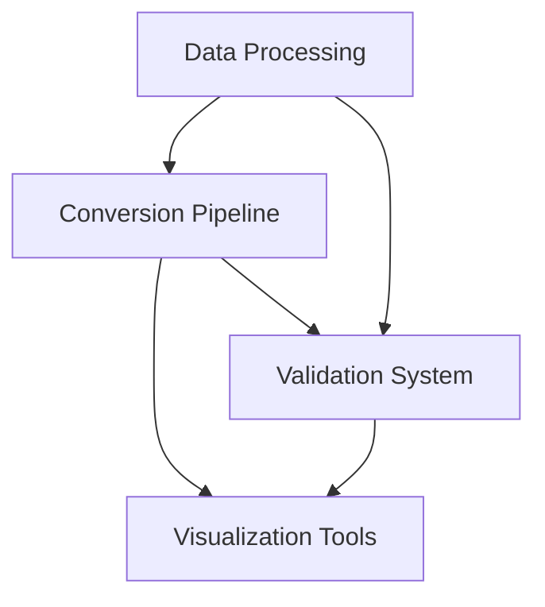

# Project Architecture

This document describes the overall architecture of the road network conversion and validation system.

## System Overview

The system consists of several main components:

1. **Data Processing**
   - OSM data parsing and validation
   - SUMO network generation and validation
   - OpenDRIVE file generation and validation
   - Coordinate system conversion

2. **Conversion Pipeline**
   - OSM to SUMO conversion
   - SUMO to OpenDRIVE conversion
   - Intermediate format handling
   - Error handling and logging

3. **Validation System**
   - Network structure validation
   - Geometry validation
   - Connection validation
   - Traffic signal validation

4. **Visualization Tools**
   - SUMO GUI visualization
   - Interactive web maps
   - Network comparison tools
   - Error visualization

## Component Dependencies



## Directory Structure

```
project/
├── src/
│   ├── converter/         # Conversion tools
│   │   ├── osm_to_sumo.py
│   │   ├── sumo_to_xodr.py
│   │   └── advanced_sumo_to_xodr.py
│   ├── validator/         # Validation tools
│   │   ├── network_validator.py
│   │   ├── junction_validator.py
│   │   └── geometry_validator.py
│   ├── visualization/     # Visualization tools
│   │   ├── visualize_in_sumo.py
│   │   └── visualize_with_folium.py
│   └── utils/            # Utility functions
│       ├── coordinate_converter.py
│       └── network_utils.py
├── tests/
│   ├── converter/        # Conversion tests
│   ├── validator/        # Validation tests
│   └── visualization/    # Visualization tests
├── data/
│   ├── networks/         # Network files
│   └── visualizations/   # Visualization outputs
└── docs/                 # Documentation
```

## Core Components

### 1. Converter Module
- **Purpose**: Handle format conversions between OSM, SUMO, and OpenDRIVE
- **Key Classes**:
  - `SumoNetworkParser`: Parse SUMO network files
  - `OpenDriveGenerator`: Generate OpenDRIVE files
  - `NetworkConverter`: Main conversion class
- **Dependencies**:
  - `sumolib` for SUMO operations
  - `lxml` for XML processing
  - `osmnx` for OSM operations

### 2. Validator Module
- **Purpose**: Validate network structure and properties
- **Key Classes**:
  - `NetworkValidator`: Validate overall network
  - `JunctionValidator`: Validate junctions
  - `GeometryValidator`: Validate geometry
- **Dependencies**:
  - `numpy` for geometric calculations
  - `shapely` for spatial operations

### 3. Visualization Module
- **Purpose**: Visualize networks and validation results
- **Key Classes**:
  - `NetworkVisualizer`: Main visualization class
  - `MapGenerator`: Generate interactive maps
- **Dependencies**:
  - `sumo-gui` for SUMO visualization
  - `folium` for web maps
  - `matplotlib` for static plots

### 4. Utility Module
- **Purpose**: Provide common functionality
- **Key Classes**:
  - `CoordinateConverter`: Handle coordinate systems
  - `NetworkUtils`: Network operations
- **Dependencies**:
  - `pyproj` for coordinate conversion
  - `networkx` for graph operations

## Data Flow

1. **Input Processing**
   ```
   OSM File → Parser → Network Object → Validator → Valid Network
   ```

2. **Conversion Pipeline**
   ```
   OSM Network → SUMO Converter → SUMO Network → OpenDRIVE Converter → OpenDRIVE Network
   ```

3. **Validation Process**
   ```
   Network → Structure Validator → Geometry Validator → Connection Validator → Validation Report
   ```

4. **Visualization Pipeline**
   ```
   Network → SUMO Visualizer → SUMO GUI
   Network → Map Generator → Interactive Map
   ```

## Error Handling

1. **Conversion Errors**
   - Invalid input formats
   - Missing required attributes
   - Geometry conversion issues
   - Coordinate system problems

2. **Validation Errors**
   - Network structure issues
   - Geometry inconsistencies
   - Connection problems
   - Traffic signal errors

3. **Visualization Errors**
   - Display issues
   - Map generation problems
   - Coordinate conversion errors

## Configuration

1. **Network Settings**
   - Default lane widths
   - Speed limits
   - Junction priorities
   - Traffic signal timing

2. **Conversion Settings**
   - Coordinate system
   - Geometry precision
   - Attribute mapping
   - Error tolerance

3. **Validation Settings**
   - Structure rules
   - Geometry tolerance
   - Connection rules
   - Error thresholds

## Notes

- All components are modular and can be used independently
- Configuration is centralized in `config.py`
- Error handling is consistent across components
- Documentation is maintained in the `docs` directory 