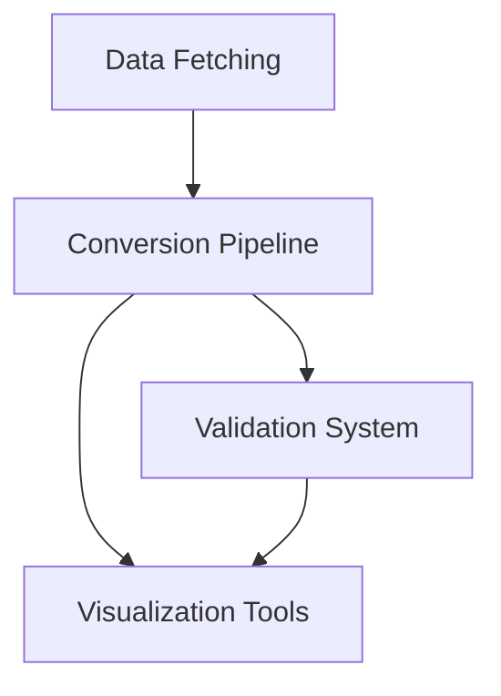

# Project Architecture

This document describes the overall architecture of the road network conversion and validation system.

## System Overview

The system consists of several main components:

1. **Data Fetching**
   - OSM data download
   - Coordinate-based data retrieval
   - Data format conversion

2. **Conversion Pipeline**
   - OSM to SUMO conversion
   - SUMO to OpenDRIVE conversion
   - Intermediate format handling

3. **Validation System**
   - Schema validation
   - Geometry validation
   - Visual comparison tools

4. **Visualization Tools**
   - Network visualization
   - Comparison visualization
   - Interactive maps

## Component Dependencies



## Directory Structure

```
project/
├── src/
│   ├── converter/         # Conversion tools
│   ├── validator/         # Validation tools
│   ├── visualizer/        # Visualization tools
│   └── utils/            # Utility functions
├── tests/
│   ├── converter/        # Conversion tests
│   ├── validator/        # Validation tests
│   └── visualizer/       # Visualization tests
├── data/
│   ├── input/           # Input files
│   ├── output/          # Output files
│   └── plots/           # Generated plots
├── docs/                # Documentation
└── validation/          # Validation reports
```

## Data Flow

1. **Input Data**
   - OSM XML files
   - SUMO network files
   - OpenDRIVE files

2. **Processing**
   - Data parsing
   - Format conversion
   - Validation checks

3. **Output**
   - Converted files
   - Validation reports
   - Visualizations

## Error Handling

The system implements a comprehensive error handling strategy:

1. **Input Validation**
   - File format checks
   - Data integrity verification
   - Required field validation

2. **Processing Errors**
   - Conversion failures
   - Validation errors
   - Visualization issues

3. **Error Reporting**
   - Detailed error messages
   - Log files
   - Visual feedback

## Performance Considerations

1. **Memory Management**
   - Large file handling
   - Data streaming
   - Cache utilization

2. **Processing Optimization**
   - Parallel processing
   - Batch operations
   - Incremental updates

## Security

1. **Input Validation**
   - File type verification
   - Size limits
   - Content validation

2. **Output Security**
   - Access control
   - Data sanitization
   - Error message handling

## Future Extensions

1. **Planned Features**
   - Additional format support
   - Enhanced visualization
   - Performance improvements

2. **Integration Points**
   - External APIs
   - Third-party tools
   - Custom extensions 